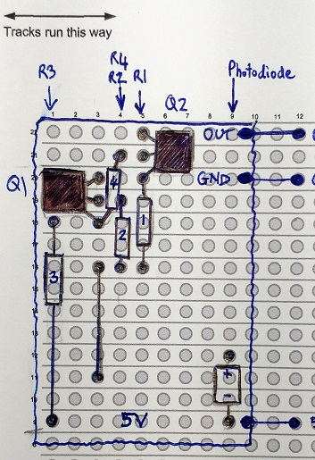

# Car Sensor

Why a new sensor?

The sensor on the pitlane track piece is mounted on a circuitboard with all other control circuitry and microcontroller. The code in the microcontroller only detects whether a car is requesting pit lane access. It does not know which car has passed the sensor.

If we know which car passed the sensor, all sorts of possibilities are open to us.

 1. SinBin. A race director can pull a specific car into the pits for a penalty. The pit track does this automatically. No need for Race Management Software (RMS) support
 2. JokerLaps. Allows different routes around a circuit. Can be set either as a short cut for slower drivers to catch up, or as in FIA RallyCross as a slower lap to be completed once every X laps. RMS support would be required for some options.
 3. PitLane. With pit in/out sensors. RMS support required.

Reprogramming the onboard microcontroller would have been nice, but I could not find any information about it. I also didn't want to have to write highly optimised code on the low powered processor. Life is too short for that. As of 2017, microcontroller with Wifi are available with 80MHz processors for under £3, so it seemed a no-brainer to replace the entire board with one I with enough power to have its own web page user interface, and could be programmed in C++ rather than assembly language.

## The Board

Component | Value
--------- | -------
R1 | 100K
R2 | 330
R3 | 2K2
R4 | 1K
Q1,Q2 | BC547
Photodiode | BPW34-FA

This sensor board can be easily build from veroboard (stripboard). No cuts are required to the stripboard tracks. It is laid out so it fits neatly under the track, with all the components in the void between the slot and edge of track. 

It is secured with black hot glue in the location of the original sensor which was removed  along with  its circuitboard. The sensor hole was enlarged with a scalpel. Before gluing, insert a spare piece of verboard right into the slot where the sonsor is going to go, to simulate one of the new deeper guide blades (which are present on my Sierra Cosworth and BMW E30 Touring cars)

The circuit uses a photodiode with built in IR filter and a wide angle to "see" the pulsed Infrared signal coming from the LED in the bottom of Scalextric digital "chip".
The raw signal from the photodiode isn't strong enough to use on its own, so the two transistor circuit amplifies and cleans up the signal to give a nice sqaure wave which we can easily with an arduino or other microcontroller.

And yes, I know it isn't pretty, and my soldering is a mess!

")

)")

")

")

## Credits
I am not an electrical engineer. This circuit is completely stolen from electricimages.co.nz. 

")

The authors site has been neglected, but you can still get to many pages by hacking around with the URL

### Accessing Electricimages.co.nz
Go to the categories page. Each category lists all pages correctly
Clicking a page incorrectly goes to the home page.
Modify the url

From
http://www.electricimages.co.nz/SSD_Decoder.ashx
To
http://www.electricimages.co.nz/History.aspx?Page=SSD_Decoder&Revision=1
Then on the page, use the dropdown to make sure you have the latest revision of the page